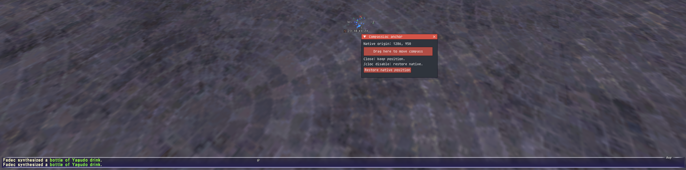

# WARNING!
### This addon is currently awaiting approval by  Phoenix admins. Do NOT use it yet unless you are willing to risk your account.


# CompassLoc

An Ashita v4 addon by **Mage** that repositions the original FFXI compass and clock. Drag the configuration control to choose a position; closing it keeps the native assembly there, even when chat height changes. Positions and enabled state are saved per character.

## Installation

Download [`compassloc-1.0.zip`](releases/compassloc-1.0.zip) and extract its `compassloc` folder into `<Ashita>/addons/`. Alternatively, copy `addons/compassloc` from this repository. Replace the entire folder when upgrading. Requires Windows x86 LuaJIT and Ashita's bundled `common`, `settings` and `imgui` libraries.

```text
/addon load compassloc
/cloc
```

Hold **Drag here to move compass** and move the mouse. Close the panel or run `/cloc` again to hide the controls while retaining the position. `/compassloc` is an equivalent alias.

| Command | Action |
| --- | --- |
| `/cloc` | Toggle configuration; first use starts at the current native origin. |
| `/cloc enable` | Apply the saved position. |
| `/cloc disable` | Restore native chat-relative positioning and retain the saved anchor. |
| `/cloc reset` | Restore native positioning and clear the saved anchor. |
| `/cloc set <x> <y>` | Set the native origin in viewport coordinates. |
| `/cloc help` | Show commands. |

Settings live under `<Ashita>/config/addons/compassloc/<Character>_<ServerId>/settings.lua`. An enabled anchor reapplies after reload/login; unloading restores native positioning. The origin is not the assembly's visible top-left. Placement adapts to viewport dimensions, but extreme edges can clip native elements.

The native hold/release backend has been tested on Phoenix-xi and HorizonXI. This cleaned release has passed local checks; saved-position lifecycle and other UI scales/display modes still need broader in-game validation. Matching compatible code can survive relocated addresses; a changed or ambiguous implementation is refused.

## Memory changes and credit

CompassLoc changes the argument-load bytes at **setter +9..+13**, published through an eight-byte exchange at **+8..+15**. These native setters write only the compass object's **X WORD at +0x28** and **Y WORD at +0x2A**. Function/global locations are found through guarded signatures, and original instructions are restored on disable/unload. Thanks to Ashita's [mapdot addon](https://github.com/AshitaXI/Ashita-v4beta/blob/4171c74c8ddb2ca2a31654f199e6c1cee40d7256/addons/mapdot/mapdot.lua) for the initial compass memory fingerprint.


## Screenshot of dialog

